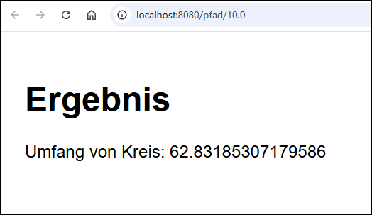

# REST-API mit Spring Boot: Kreisumfang #

 

Dieses Repo enthält ein Maven-Projekt für eine Java-Anwendung mit *Spring Boot*, die ein
sehr einfaches Beispiel für Thymeleaf-Templates enthält.

 

 

----

## License ##

 

See the [LICENSE file](LICENSE.md) for license rights and limitations (BSD 3-Clause License).

 